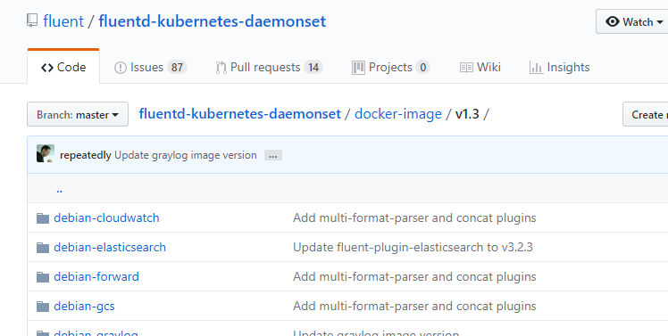
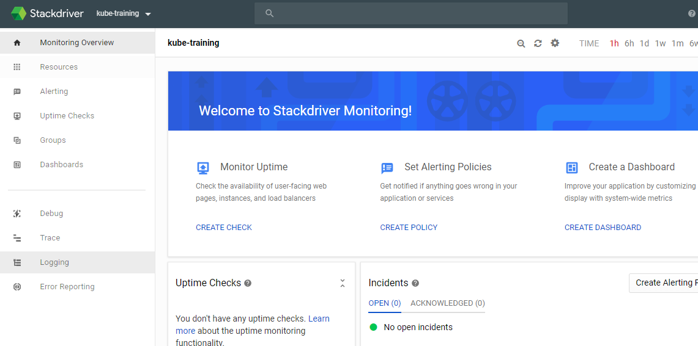
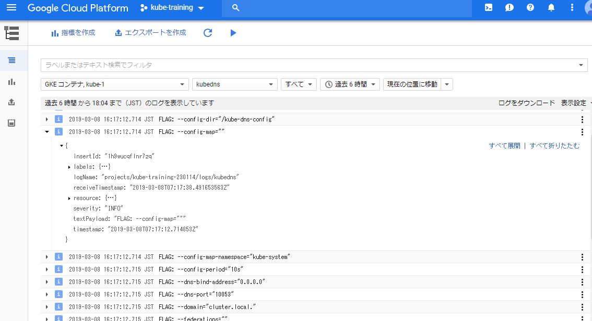

name: inverse
layout: true
class: center, middle, inverse

---
## Kubernetes入門

Logging

---
layout: false
### Assumptions

- Kubernetesの概要程度の知識

### Targets

- Logging未経験者

---
### Logging

- 標準出力と標準エラー出力にログを出力

- "kubectl logs"コマンドで表示

- 安定保存のため、ログを集約して外部に転送

---
### Logging

.zoom1[
```console
$ kubectl logs kube-dns-[num] -c kubedns -n kube-system
```
]

<center></center>

---
### Landscape

<center></center>

---
### Tools

- Fluentd

- Datadog

etc...

---
class: center, middle, inverse
# Fluentd

---
### Fluentd

.right-small[
<center></center>
]

.left-large[
- CNCFがホストするプロジェクト

- DaemonSetを利用

- 標準出力ログを読み出して転送
]

---
### Before Fluentd

<center></center>

---
### After Fluentd

<center></center>

---
### Architecture

- Unified Logging with JSON  
  プロセス(収集、フィルタリング、出力)の統一

- Pluggable Architecture  
  フレキシブルな入出力プラグイン

- Minimum Resources Required

- Built-in Reliability  
  バッファ、フェイルオーバーによるHA構成

---
### Forward To

- CloudWatch
- Elasticsearch
- Google Cloud Storage(GCS)
- Graylog
- Kafka
- Kinesis
- Amazon S3
- Stackdriver
- Syslog

etc...

---
### Get Started

[公式イメージ](https://github.com/fluent/fluentd-kubernetes-daemonset/tree/master/docker-image/v1.3)

<center></center>

---
class: center, middle, inverse
## Get Started with GKE

---
### Get Started with GKE

GKEではリソース作成済み

```console
$ kubectl get po -n kube-system | grep fluentd
// 結果は一部省略
fluentd-gcp-scaler-8b674f786-jc4wk  1/1  Running
fluentd-gcp-v3.2.0-4hqm6            2/2  Running
fluentd-gcp-v3.2.0-m5p49            2/2  Running
fluentd-gcp-v3.2.0-x6rlq            2/2  Running

```

---
### Stackdriver

Real-time Log Management and Analysis

- Seamlessly Resolve Issues

- Scalable and Fully Managed

- All Your Cloud Logs In One Place

- Real Time Insights

---
### Stackdriver Monitoring

<center></center>

---
### Stackdriver Logs Viewer

<center></center>

---
class: center, middle, inverse
# Demo

---
### Datadog

.right-small[
<center></center>
]

.left-large[
- SaaS型の監視＆解析ツール

- 課金制

- 様々なサービスのメトリクスをシームレスに集約
]

---
### Log Explorer

<center></center>

---
### 

- 

- 

- 

- 

---
### Fluent Bit

<center></center>

- シンプルかつ軽量なFluentd

- 既存のプラグインは使用不可

---
### Books

<center></center>

---
### Website

[Datadog - 公式](https://www.datadoghq.com/)

[Fluentd - 公式](https://www.fluentd.org/)

[Fluentd - GitHub](https://github.com/fluent)

[Stackdriver Logging - 公式](https://cloud.google.com/logging/)